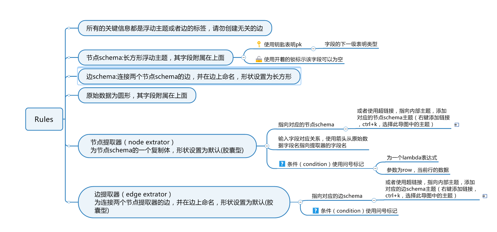

# mindmap_etl
使用 .xmmap 思维导图文件构建模型和ETL导入逻辑，转换为图数据库需要的结构。

# Rules

# Example

下图使用mindmanager编辑，你可以从这里下载mindmanager 2019的xx版本：

    链接：https://pan.baidu.com/s/1JGNL3Vu5bjAb9ofOU386XQ 
    提取码：pfes 
    复制这段内容后打开百度网盘手机App，操作更方便哦

尝试示例，请执行以下命令：

1. `git clone https://github.com/tr33oph/mindmap_etl.git`
2. `cd mindmap_etl`
3. `pip3 install .`
4. `python3 loader.py` 查看输出

或者：

1. `pip3 install mindmap_etl`
2. `python3 loader.py` 查看输出

你可以参考`loader.py`编写自己的代码。
